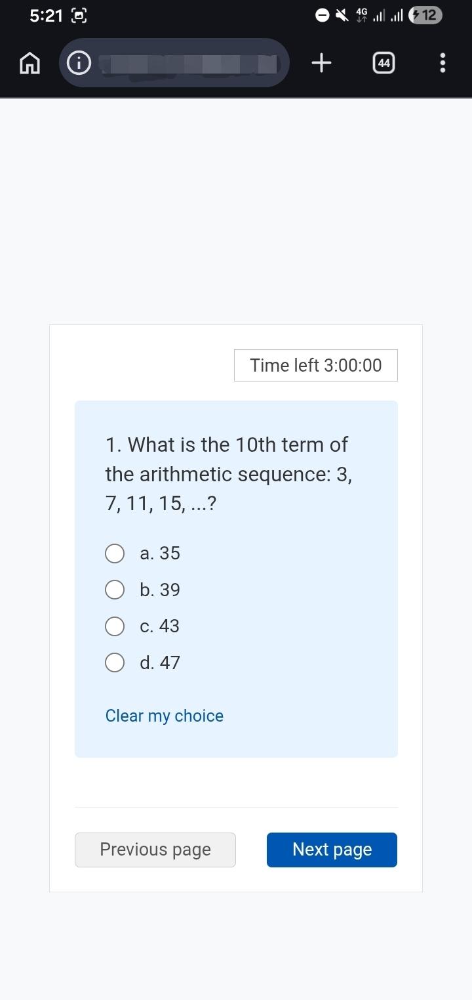

# EUEE Simulator 🚀

  
  
<i>A lightweight, interactive exam simulator designed to help Ethiopian students prepare for the University Entrance Examination (EUEE).</i>

---

## 💡 Overview
This repository serves as the public documentation and case study. The core source code is currently hosted in a private environment, but this page outlines the architecture, features, and technical challenges solved.

### 🔗 Links
live demo : [comming soon]

## ✨ Key Features
* **Dynamic Time Management:** An integrated countdown timer that replicates the high-pressure environment of the national exam, helping students master their pacing.
* **Authentic Exam Environment:** A clean, distraction-free UI modeled after the official EUEE digital interface to reduce "exam anxiety" through familiarity.
* **Responsive Design:** Fully optimized for mobile and desktop using CSS Grid/Flexbox.

## 🛠️ Tech Stack
**Frontend:** HTML5, CSS3, JavaScript (Vanilla)

## 📸 Gallery
 
<!--
-->

---
*Made by HexPredators. Feel free to reach out via [Email](contact.hexpredators@gmail.com) .*

